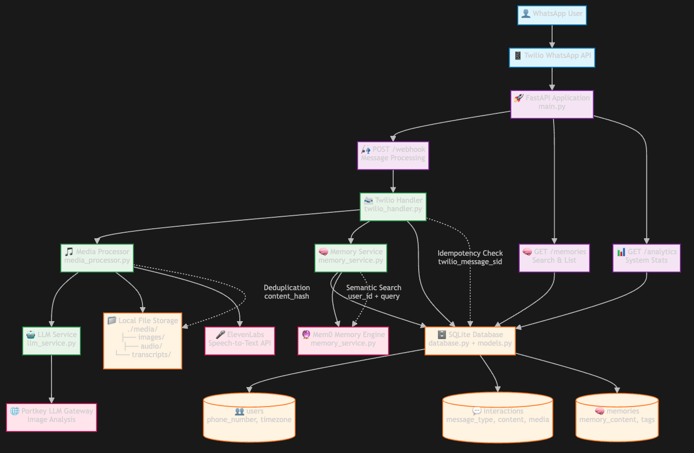

# WhatsApp Memory Assistant 🧠💬

A sophisticated WhatsApp chatbot that uses Mem0's memory layer to intelligently store, process, and retrieve multimodal memories from your conversations. Built with FastAPI, SQLite, and integrated with Twilio's WhatsApp API.

## 🌟 Features

### Core Functionality
- **📝 Text Memory**: Store and recall text messages with semantic search
- **📸 Image Analysis**: Convert images to descriptive text using any LLM via Portkey
- **🎤 Voice Transcription**: Convert voice messages to text using ElevenLabs Speech-to-Text API
- **🔍 Natural Language Search**: Query memories using conversational language
- **📋 Memory Management**: List, filter, and organize all saved memories

### Advanced Features
- **🔄 Idempotent Processing**: Duplicate message protection
- **📎 Media Deduplication**: Smart storage of identical files
- **🌍 Timezone Support**: Time-aware queries and filtering
- **📊 Analytics Dashboard**: Usage statistics and insights
- **🏷️ Smart Tagging**: Automatic categorization of memories
- **💡 Mood Detection**: Sentiment analysis of messages

## 🏗️ Architecture

### System Overview



## 🚀 Quick Start

### 1. Prerequisites

- Python 3.8+
- Twilio Account with WhatsApp API access
- Mem0 API key
- ElevenLabs API key (for transcription)
- ngrok (for local development)

### 2. Installation

```bash
# Clone the repository
git clone <your-repo-url>
cd whatsapp-memory-assistant

# Create virtual environment
python3 -m venv venv
source venv/bin/activate  # On Windows: venv\\Scripts\\activate

# Install dependencies
pip install -r requirements.txt
```

### 3. Environment Configuration

Create a `.env` file:

Create a new .env file using the .env.example file and replace all the values with the relevant keys

### 4. Database Setup

Run database migrations using Alembic:

```bash
# use alembic directly
alembic upgrade head
```

### 5. Seed Database (Optional)

Populate the database with sample data for testing and evaluation:

```bash
# Initialize database with sample data
python scripts/seed_db.py
```

This creates:
- 3 sample users with different timezones
- Various interaction types (text, image, audio)
- Linked memories with realistic timestamps
- Sample media files and directories


### 6. Webhook Setup

#### For Local Development:

```bash
# In a new terminal, start ngrok
ngrok http 8000

# Copy the HTTPS URL (e.g., https://abc123.ngrok.io)
```

#### Configure Twilio Webhook:

1. Go to [Twilio Console](https://console.twilio.com/)
2. Navigate to Messaging → Settings → WhatsApp sandbox settings
3. Set webhook URL to: `https://your-ngrok-url/webhook`
4. Set HTTP method to `POST`

### 7. Start the Application

```bash
uvicorn src.main:app --host 0.0.0.0 --port 8000 --reload
```

## 📱 Usage

### WhatsApp Commands

1. **Send any message**: Automatically saved to memory
2. **Send photos**: Analyzed and stored with optional captions
3. **Send voice messages**: Transcribed and saved
4. **Query memories**: "What did I say about dinner yesterday?"
5. **List memories**: Type `/list` or "show all my memories"
6. **Time-based queries**: "Show me photos from last week"

### Example Conversations

```
You: I'm planning to cook pasta tonight with mushrooms and cheese
Bot: Got it! I've saved your message to memory. 📝

You: [Send photo of ingredients]
Bot: 📸 I've saved your image to memory!

You: [Send voice note about grocery list]
Bot: 🎤 Got your voice message: "Need to buy tomatoes, bread, and milk..."

You: What did I plan for dinner?
Bot: 🔍 Here's what I found for 'dinner':
     1. I'm planning to cook pasta tonight with mushrooms and cheese

You: /list
Bot: 🗂️ Your Recent Memories (3 total):
     1. Voice message: Need to buy tomatoes, bread, and milk... (2023-12-01)
     2. Image shared by user (2023-12-01)
     3. I'm planning to cook pasta tonight with mushrooms and cheese (2023-12-01)
```

## 🔌 API Endpoints

### Core Endpoints

| Method | Endpoint | Description |
|--------|----------|-------------|
| POST | `/webhook` | Twilio webhook handler |
| GET | `/health` | Health check |
| GET | `/` | Basic status |

### Memory Management

| Method | Endpoint | Description |
|--------|----------|-------------|
| POST | `/memories` | Add memory manually |
| GET | `/memories?query=<text>&user_id=<id>` | Search memories |
| GET | `/memories/list?user_id=<id>` | List all memories |

### Analytics & Insights

| Method | Endpoint | Description |
|--------|----------|-------------|
| GET | `/interactions/recent?limit=<n>` | Recent interactions |
| GET | `/analytics/summary` | System analytics |

### API Examples

#### Search Memories
```bash
curl "http://localhost:8000/memories?query=dinner&user_id=user123"
```

#### Get Analytics
```bash
curl "http://localhost:8000/analytics/summary"
```

Response:
```json
{
  "total_users": 5,
  "total_interactions": 47,
  "total_memories": 52,
  "interactions_by_type": {
    "text": 25,
    "image": 15,
    "audio": 7
  },
  "last_ingest_time": "2023-12-01T15:30:00",
  "metrics": {
    "avg_interactions_per_user": 9.4,
    "avg_memories_per_user": 10.4,
    "memory_to_interaction_ratio": 1.11
  }
}
```

## 🔧 Implementation Details

### Idempotency Strategy
- Uses Twilio's `MessageSid` as unique identifier
- Database constraints prevent duplicate processing
- Returns existing interaction ID if message already processed

### Media Deduplication
- Generates SHA256 hash of file content
- Stores media files once, references multiple times
- Reduces storage space and processing overhead

### Timezone Awareness
- Stores user timezone in database
- Supports queries like "last week" relative to user location
- Uses `pytz` for accurate timezone conversions

### Error Handling
- Graceful degradation for failed transcriptions
- Retry logic for external API calls
- Comprehensive logging and error responses
- User-friendly error messages via WhatsApp

### Security Considerations
- Input sanitization for all user content
- Content length limits to prevent abuse
- Secure API key management via environment variables
- No sensitive data logged or exposed

## 🧪 Testing

Run the test suite:

```bash
# Run all tests
pytest tests/ -v

# Run specific test file
pytest tests/test_basic.py -v

# Run with coverage
pytest tests/ --cov=src --cov-report=html
```

### Test Coverage

The test suite covers:
- ✅ API endpoint functionality
- ✅ Database operations
- ✅ Utility functions
- ✅ Error handling
- ✅ Media deduplication
- ✅ Webhook processing